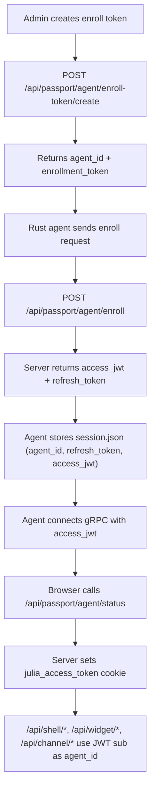

# Passport Domain

`passport` is the canonical auth/session/status domain for JuliaApp.

## Scope

- Shared JWT model for **agent + browser** (`access_jwt`).
- Agent enrollment/refresh/revoke API under `/api/passport/agent/*`.
- Cookie bootstrap (`julia_access_token`) for shell/widget/channel APIs.
- Online-status UI + Zustand slice (`domains/passport/client` + `domains/passport/ui`).
- Server runtime/session persistence in `passport.db`.

## Flow

## API

| Endpoint | Method | Notes |
| --- | --- | --- |
| `/api/passport/agent/enroll-token/create` | `POST` | Admin-only, returns `agent_id + enrollment_token` |
| `/api/passport/agent/enroll-token/list` | `GET` | Admin-only |
| `/api/passport/agent/enroll-token/revoke` | `POST` | Admin-only |
| `/api/passport/agent/enroll` | `POST` | Requires strict pair `agent_id + enrollment_token` |
| `/api/passport/agent/token/refresh` | `POST` | Rotates refresh token and returns new access JWT |
| `/api/passport/agent/token/revoke` | `POST` | Revokes refresh token |
| `/api/passport/agent/status` | `GET` | Returns online status and bootstraps cookie |
| `/api/passport/agent/status/retry` | `POST` | Retry snapshot + cookie fallback |

## Cookie Policy

- Cookie name: `julia_access_token`
- `HttpOnly`
- `SameSite=Lax`
- `Path=/`
- `Secure` when request is HTTPS

## Per-agent Storage

- `passport.db`: agent registry, sessions, tokens, events, enrollment tokens.
- `core.db`: shell settings/layout/module state keyed by `agent_id`.
- `transcribe.db`: jobs/outbox/settings/recent folders/aliases keyed by `agent_id`.

